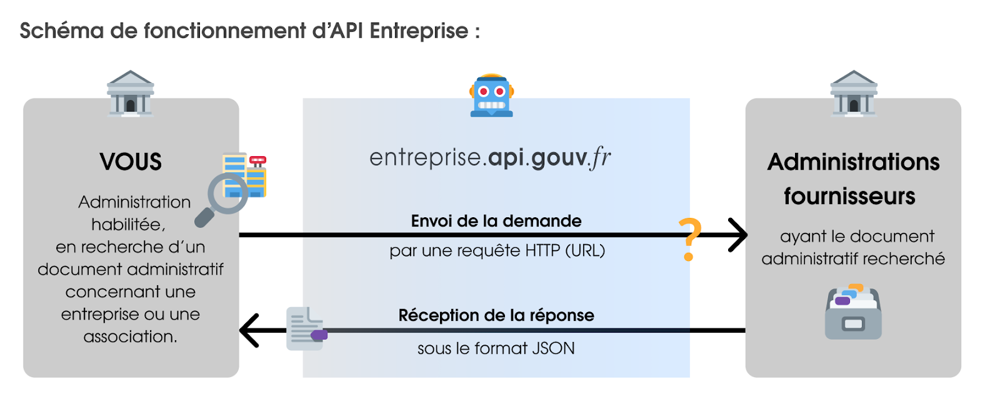

## Étape 1 : L'API Entreprise correspond-elle à mon besoin ?

\[Module du questionnaire : https://whimsical.com/TL89xgeqHhWEPPeZQrgGXG]

<details class="fold">
<summary>
### Les cas d’usage d’API Entreprise
</summary>

API Entreprise répond à deux grands types d’usages :

<details class="fold">
<summary>
###### Le pré-remplissage d'un formulaire à destination du public
</summary>

Vous pouvez mettre en place une aide à la saisie pour vos usagers, avec les endpoints `entreprises`, `etablissements` et `associations`. L’usager renseigne son numéro de SIRET, ou toute autre valeur discriminante ; le formulaire est alors pré-rempli des champs disponibles par votre API.

{:.tpl-notification}
La création d’un formulaire pré-rempli est faite pour assister l’usager, celui-ci doit toujours pouvoir amender, rectifier ces mêmes informations sans difficultés.

> L'AIFE a mis en place une démarche dématérialisée pour permettre aux entreprises d’obtenir leur \[document Unique de Marché Européen](<> https://dume.chorus-pro.gouv.fr/#/>). Elle utilise l'API Entreprise pour pré-remplir les formulaires de ses utilisateurs :
>
> <video controls width="250">\

⚠️ **Le pré-remplissage est possible uniquement pour des APIs distribuant des informations publiques.**
Par exemple, l’endpoint `entreprise` qui regroupe des données ouvertes et fermées, ne peut être utilisé pour le pré-remplissage, que **si et seulement si** les entreprises non-diffusibles (dont les données sont confidentielles) ne sont pas appelées.

ℹ️ **Quel avantage à passer par API Entreprise si les données sont libres ?** API Entreprise vous simplifie l'implémentation de cette aide à la saisie, en vous donnant accès à une information structurée, facilement intégrable dans votre produit.

</details>

<details class="fold">
<summary>
###### L’obtention d’une donnée en back office par un agent habilité
</summary>

L'API entreprise sert aux agents habilités à récupérer automatiquement des informations, elle donne accès : 

* soit à des justificatifs, certificats, bilans, ... papier numérisés ou document PDF ;
* soit à la donnée brute, décrite par un champ JSON, qui permet une automatisation plus performante encore.
* soit les deux.

</details>

\[BOUTON VERS CAS USAGE]

</details>

<details class="fold">
<summary>
### Le service : une API, plusieurs données et plusieurs fournisseurs
</summary>
#### Les qualités du service

**API Entreprise démarche les administrations et fait les différentes demandes d’accès.** Si votre demande d'habilitation est validée, vous avez une seule clé d’accès sécurisée. De plus, API Entreprise agrège et vous restitue les connaissances techniques et métiers.

{:.tpl-notification}
Sans API Entreprise, vous êtes obligé de demander toutes les APIs nécessaires à votre service, auprès des différentes administrations. Cette recherche n'est pas forcément fructueuse car les organisations n'ont pas toujours un site ou un contact public pour leurs APIs ; par ailleurs, vous devez ensuite comprendre plusieurs système techniques, générer plusieurs mots de passe, collaborer avec plusieurs contacts techniques et métier.

#### La liste exhaustive des données

##### Informations générales <a id="infos_generales"></a>

{:.tpl-table}
| Données                                              |        Producteur        |                 Endpoint                  |        Type         |    Ouverture    |
| ----------------------------------------------------- |:------------------------:|:-----------------------------------------:|:-------------------:|:---------------:|
| [Données de référence d'une entreprise](https://doc.entreprise.api.gouv.fr/?json#entreprises){:target="_blank"}                  |    INSEE & Infogreffe    |            `entreprises`            |    données JSON     |    publiques    |
| [Données de référence d'un établissement](https://doc.entreprise.api.gouv.fr/?json#etablissements){:target="_blank"}                |          INSEE           |          `etablissements`           |    données JSON     |    publiques    |
| [Extrait  RCS](https://doc.entreprise.api.gouv.fr/?json#infogreffe-extrait-rcs){:target="_blank"}                                           |        Infogreffe        |         `extraits_rcs_infogreffe`         |    données JSON     |    publiques    |
| [Informations déclaratives d'une association](https://doc.entreprise.api.gouv.fr/?json#associations-rna){:target="_blank"}                 | Ministère de l'Intérieur |              `associations`               |    données JSON     |    publiques    |
| [Divers documents d'une association](https://doc.entreprise.api.gouv.fr/?json#documents-association){:target="_blank"}                     | Ministère de l'Intérieur |         `documents_associations`          |     PDF (image)     |    publiques    |
| [Actes](https://doc.entreprise.api.gouv.fr/?json#documents-association){:target="_blank"}                     | INPI |         `actes_inpi`          |       Archive ZIP (PDF et XML)   |    publiques    |

##### Informations financières <a id="infos_financieres"></a>

{:.tpl-table}
| Données                                              |        Producteur        |                 Endpoint                  |        Type         |    Ouverture    |
| ----------------------------------------------------- |:------------------------:|:-----------------------------------------:|:-------------------:|:---------------:|
| [Chiffre d'affaires](https://doc.entreprise.api.gouv.fr/?json#exercices){:target="_blank"}                                     |          DGFIP           |                `exercices`                |    données JSON     | confidentielles |
| [Bilans annuels](https://doc.entreprise.api.gouv.fr/?json#bilans-entreprises-bdf-banque-de-france){:target="_blank"}                                      |     INPI     |         `bilans_inpi`          |    données JSON     | publiques et confidentielles |
| [3 derniers bilans annuels](https://doc.entreprise.api.gouv.fr/?json#bilans-entreprises-bdf-banque-de-france){:target="_blank"}                                      |     Banque de France     |         `bilans_entreprises_bdf`          |    données JSON     | confidentielles |
| [Déclarations de résultats](https://doc.entreprise.api.gouv.fr/?json#les-d-clarations-des-liasses-fiscales){:target="_blank"}       |          DGFIP           |         `liasses_fiscales_dgfip`          |    données JSON     | confidentielles |

##### Attestations sociales et fiscales <a id="attestations_sociales_fiscales"></a>

{:.tpl-table}
| Données                                              |        Producteur        |                 Endpoint                  |        Type         |    Ouverture    |
| ----------------------------------------------------- |:------------------------:|:-----------------------------------------:|:-------------------:|:---------------:|
| [Attestation fiscale](https://doc.entreprise.api.gouv.fr/?json#attestation-fiscale-dgfip){:target="_blank"}                                    |          DGFIP           |       `attestations_fiscales_dgfip`       |     PDF (texte)     | confidentielles |
| [Attestation de vigilance](https://doc.entreprise.api.gouv.fr/?json#attestation-sociale-acoss){:target="_blank"}                               |          ACOSS           |       `attestations_sociales_acoss`       |     PDF (texte)     | confidentielles |
| [Conformité emploi des travailleurs handicapés](https://doc.entreprise.api.gouv.fr/?json#attestation-agefiph){:target="_blank"}  |         AGEFIPH          |          `attestations_agefiph`           |    données JSON     | confidentielles |
| [Cotisation de sécurité sociale agricole](https://doc.entreprise.api.gouv.fr/?json#cotisations-msa){:target="_blank"}                |           MSA            |             `cotisations_msa`             |    données JSON     | confidentielles |
| [Cotisations retraite bâtiment](https://doc.entreprise.api.gouv.fr/?json#cotisations-retraite-probtp){:target="_blank"}                       |          PROBTP          | `attestations_cotisation_retraite_probtp` |    données JSON     |    publiques    |
| [Carte professionnelle travaux publics](https://doc.entreprise.api.gouv.fr/?json#certificats-cnetp){:target="_blank"}         |          FNTP           |            `cartes_professionnelles_ftp`            |         PDF         |    publiques    |
| [Cotisations congés payés & chômage intempéries](https://doc.entreprise.api.gouv.fr/?json#certificats-cnetp){:target="_blank"}         |          CNETP           |            `certificats_cnetp`            |         PDF         |    publiques    |

##### Certifications professionnelles <a id="certificats_pro"></a>

{:.tpl-table}
| Données                                              |        Producteur        |                 Endpoint                  |        Type         |    Ouverture    |
| ----------------------------------------------------- |:------------------------:|:-----------------------------------------:|:-------------------:|:---------------:|
| [Certification RGE](https://doc.entreprise.api.gouv.fr/?json#certificats-rge-ademe){:target="_blank"}                                      |          ADEME           |          `certificats_rge_ademe`          | données JSON et PDF |    publiques    |
| [Certification de qualification bâtiment](https://doc.entreprise.api.gouv.fr/?json#certificats-qualibat){:target="_blank"}                  |          OPQIBI          |           `certificats_qualibat`            |    données JSON     |    publiques    |
| [Certification de qualification d'ingénierie](https://doc.entreprise.api.gouv.fr/?json#certificats-opqibi){:target="_blank"}                  |          OPQIBI          |           `certificats_opqibi`            |    données JSON     |    publiques    |

##### Propriété intellectuelle <a id="propriete_intellectuelle"></a>

{:.tpl-table}
| Données                                              |        Producteur        |                 Endpoint                  |        Type         |    Ouverture    |
| ----------------------------------------------------- |:------------------------:|:-----------------------------------------:|:-------------------:|:---------------:|
| [Brevets, modèles et marques déposés](https://doc.entreprise.api.gouv.fr/?json#extraits-courts-inpi){:target="_blank"}                   |           INPI           |          `extraits_courts_inpi`           |    données JSON     |    publiques    |

#### Une documentation technique et métier par endpoint

Toutes les données de la liste précédente sont détaillées dans le [catalogue de données](https://entreprise.api.gouv.fr/catalogue/). Une barre de recherche est à votre disposition pour filtrer les données :


Chaque endpoint est présenté de façon synthétique :

Des informations complémentaires, dont le détail précis des champs délivrés par l’API sont disponibles en cliquant sur le bouton “documentation” :

#### Nos engagements

Utiliser le service API Entreprise, c'est aussi bénéficier des engagements de la Direction du Numérique : 

* **L’engagement de disponibilité est de 99,5 %.**
  La disponibilité des données est consultable en temps réel pour chaque endpoint dans le catalogue des donnée. Une historisation est aussi publiée, ainsi que les rapports d’incidents et les perspectives de résolution. Par ailleurs, les informations sur votre consommation sont disponibles dans votre tableau de bord.

  {:.tpl-notification}
  Toutefois, ce service agrégeant de nombreux fournisseurs de données et étant donc dépendant de leurs disponibilités, API Entreprise ne porte donc aucune responsabilité s’agissant de la qualité ou du contenu intrinsèque des données. Par ailleurs, le service ne modifie pas les données à l’exception d’une standardisation contextuelle limitée (minuscule vers majuscule, format de date, nombre d’espaces).
* **L’utilisation d’API Entreprise est gratuite.**
  Les coûts d’investissements et de fonctionnement sont pris en charge par la DINUM. En revanche, les coûts de raccordement à API Entreprise vous incombent.
* **API Entreprise propose une assistance technique et fonctionnelle** permettant aux utilisateurs de définir et de mettre en œuvre au mieux leur projet.
* **API Entreprise respecte le cadre légal.**
  Le service s'engage à respecter en totalité les conditions de protection des données et les règles de confidentialité.

</details>
<details class="fold">
<summary>
## Un accès sous habilitation et conditions
</summary>
L'accès à l'API entreprise est réservé aux acteurs publics investis d’une mission de service public (les administrations, leurs opérateurs et les collectivités, les acteurs de santé, etc.).

Leurs prestataires privés peuvent être destinataires des informations techniques permettant l'usage de l'API mais en aucun cas des données elles-même.

Enfin, tout accès à l'API Entreprise se fait suite à une habilitation.

### S'engager à ne pas diffuser les données reçues

Premièrement, avant toute transmission de données, l’usager doit être informé, et en cas d’exposition des données, son consentement doit être explicite.

##### Dans le cas d’un pré-remplissage à destination du public

Une partie des données des endpoints `entreprise`, `etablissement` et `associations`, les données publiques, peuvent servir au pré-remplissage de formulaires publics. Même si ces données ne sont pas confidentielles, le fournisseur de service s’engage à ne pas commercialiser les données reçues au travers d'API Entreprise et à ne pas les communiquer à des tiers en dehors des cas prévus par la loi.

##### Dans le cas d’une utilisation par un agent habilité en back office

La plupart des données disponibles sur API Entreprise sont protégées par des secrets. Vous assurez donc la protection de ces données et le respect des règles de confidentialité.

Entre autres, le service ne doit pas permettre à quiconque n’ayant pas un niveau d’authentification suffisant, d’accéder à des données. Leur accès est restreint aux seuls les agents dûment habilités, dont les requêtes sont tracées pour une durée de 36 mois.

### Un équipement technique minimal nécessaire

Vous êtes techniquement en mesure de pouvoir démarrer avec API Entreprise si :

* vous travaillez ou vous vous apprêtez à travailler avec un éditeur de logiciel.
  Celui-ci doit être en mesure d’intégrer API Entreprise.
* ou bien vous avez une direction des systèmes d’information (DSI) qui peut intégrer des APIs.

Pour comprendre en détail les éléments techniques nécessaires consulter la rubrique “Les questions à poser à mon équipe technique”.

</details>
# 2 - Les prérequis techniques avant d’aller plus loin

## 🖌 Qu’est-ce qu’une API ?

Une API permet d’agir sur des ressources contenues dans un autre système d’informations, sans soi-même avoir la main sur ce système d’information.

Dans le cas qui nous occupe, les ressources sont des informations sur les entreprises, et l’action est une consultation.



### Comment se déroule un appel à l’API ?

Voici, décrit en quelques étapes, la façon dont vous ou votre équipe technique allez faire votre demande à l’API pour accéder aux données :

**Étape 1** : Je suis préalablement habilité, et j’ai donc accès à différentes données, regroupées par endpoint.

**Étape 2** : Je choisis l’endpoint qui m’intéresse ;

**Étape 3** : Je construis mon URL d’appel avec cet endpoint :

Voici les éléments qui constituent l’URL d’appel :

{:.tpl-table}
| Éléments composant la requête                                            |        Exemples                                             |
|:----------------------------------------------------------:|:-----------------------------------------:|
|**Domaine** <br>(ou préfixe) <br>qui conduit à l'API de façon sécurisée|`http://entreprise.api.fouv.fr`|
|**Numéro de la version** <br>(par défaut désormais en V2)|`/v2`|
|**Nom de la donnée recherchée** <br>(ou *endpoint*)|`/attestation_fiscale_dgfip`|
|**Identité de l'établissement concerné** <br>(souvent SIREN ou SIRET)|`/SIRENouSIRETdeL'Etablissement`|
|**Votre jeton d'accès**|`?token=JetonD'Habilitation`|
|**Cadre de la requête** <br>*Par exemple : aides publiques, marchés publics ou gestion d'un référentiel tiers utilisé pour tel type d'application.*|`&context=CadreDeLaRequête`|
|**Bénéficiaire de l'appel** <br>(siret de l'administration destinatrice des données)|`&recipient=BénéficaireDeL'Appel`|
|**La raison de l'appel** <br> ou l'indentifiant de la procédure <br>(numéro de marché publique, nom de la procédure, description courte (< 50 caractères))|`&object=RaisonDeL'AppelOuIdentifiant`|
|*\[obligatoire pour les endpoints DGFIP]*<br> **L'identifiant de l'utilisateur physique qui fait l'appel** <br>Par exemple dans le cas d'une place de marché, il s'agit de l'identifiant de l’acheteur public qui consulte la pièce. Il servira en cas d’utilisation anormal de l’API pour remonter à la source et vérifier que l’utilisateur avait bien le droit d’accéder à cette donnée. |`?user_id=IdentifiantDeL'UtilisateurPhysique`|

**Tous ces éléments mis bout à bout constituent une requête HTTP qui appelle l'API :** 

```
https://entreprise.api.gouv.fr/v2/attestation_fiscales_dgfip/SirenDeL’Entreprise?token=JetonD’Habilitation&user_id=IdentifiantDeL’UtilisateurPhysique&context=CadreDeLaRequête&recipient=BénéficaireDeL’Appel&object=RaisonDeL’AppelOuIdentifiant
```

En blanc, les éléments que je complète. Pour une explication détaillée par endpoints, je me reporte au catalogue des données.

**Étape 4** : Je passe mon appel :

* À des fins de tests, au travers de mon navigateur

Pour passer votre appel, vous pourriez écrire l’URL dans votre navigateur. La page chargée vous renverrait les données demandées.

C’est ce que nous vous proposons de faire ici par le biais d’un test uniquement.

⚠️ En effet, il y a des précautions à prendre : Par défaut l’historique de votre navigateur enregistre des informations confidentielles dont votre jeton d’accès. Or comme vous avez pu le lire dans la rubrique“conditions de (non)diffusion des données”, la grande majorité des données accessibles par API Entreprise sont protégées par des secrets, vous êtes tenus de vous assurer qu’elles ne soient pas diffusées.

* En production, par le biais d’un logiciel métier

Pour veiller à la protection des données, l’ensemble des appels que vous allez réaliser en production seront passés par l’intermédiaire d’un logiciel métier.

**Étape 5** : Je reçois une réponse comportant les données. La réponse est au format JSON, nous détaillons sa structure dans la prochaine partie.

### Comment s'interprète la réponse de l’API ?

#### Structure d’une réponse JSON

Pour chaque appel effectué vous allez recevoir une réponse au format JSON. Ce langage informatique présente l’avantage d’être lisible par un non expert ; tout en étant compréhensible par une machine.

Une réponse JSON est composée de paires `“champ”` / `“valeur”` :

* Le `“champ”`, ou “nom”, ou “clé”, décrit le type d’information, c’est un invariable.
* La “valeur” est une variable, c’est justement la donnée que vous recherchez.

**API Entreprise retourne trois grands types de réponses :**

Le JSON vous renvoie un lien URL, permettant d’accéder à un document PDF :

```
{
  "url":"http://la-fameuse-url-permettant-d-acceder-au-document.pdf"
}
```

Le JSON vous renvoie un lien URL, permettant d’accéder à une archive de plusieurs documents, au format ZIP:

```
{
   "http://la-fameuse-url-permettant-d-acceder-a-l-archive-de-documents.zip"
}
```

Le JSON vous renvoie les données, structurées :

Dans ce cas précis, les données étant toutes renvoyées au format JSON, les couples “champ” / “valeur” peuvent être regroupé dans différentes catégories.

```
{
  "eligible": true,
  "message": "00 Compte éligible pour attestation de cotisation"`
}
```

Pour une information détaillée par endpoint, reportez-vous au catalogue de données.

## Qu'est qu'un token ?

### Le token, une clé unique et privée

Le token est votre code secret vous permettant d’accéder à API Entreprise.

Si votre demande d’habilitation est validée, il vous est délivré dans votre espace personnel.

Cette clé est unique et privée ; nous nous appuyons sur un standard ouvert et normalisé de l’industrie : le Json Web Token (aka JWT) ([RFC 7519](https://tools.ietf.org/html/rfc7519)). Ce jeton est autonome et permet de transmettre de façon sécurisée les informations d'authentifications nécessaires pour utiliser l'API. Ces jetons sont vérifiés et fiables car signés numériquement avec une date d'expiration.

### Ne jamais divulguer mon token

⚠️ Votre token vous est propre, il ne faut pas le diffuser: c’est comme votre clé d’appartement, vous ne l’envoyez pas par la poste car il y a un risque que celle-ci soit interceptée par une personne mal intentionnée.

C’est pourquoi, vous ne devez jamais copier-coller un token dans un moteur de recherche ou dans un e-mail.L’usage de votre token se fait uniquement dans votre logiciel métier sécurisé utilisé pour réaliser vos appels.

### Un token a une fin de vie

La durée de vie d’un token est limitée, sa date d’expiration est indiqué dans votre espace personnel.

Le token peut également être supprimé s’il a été diffusé par mégarde.

Le renouvellement d’un token est très facile et rapide. C’est pourquoi, si vous avez divulguer votre token par erreur, n’hésitez pas à écrire rapidement au support. Pour en savoir plus le renouvellement d’un token, consultez la rubrique“renouveler un token en fin de vie”.

## Les fondamentaux à mettre en place avec l'équipe technique

Vous travaillez avec la DSI de votre administration ou avec un éditeur de logiciel, voici la liste des fondamentaux que votre équipe technique doit être en mesure de mettre en place pour un bon fonctionnement de l'API Entreprise : 

☑️ Vérifier qu’ils peuvent prendre en charge la mise à jour des protocoles de sécurité HTTPS ;

☑️ Anticiper la mise à jour du logiciel métier ;

☑️ Vérifier la version des langages. API Entreprise ne fonctionne qu’avec Java 1.7 minimum (pour la gestion des certificats de +1024 bit) ;

☑️ Vérifier les dispositifs d’alerte mis en place : certificat SSL ;

☑️ Firewall / White list IP

☑️ Anticiper les coûts de maintenance qui s'ajouteront aux coûts de mise en place.

## Prévoir les incidents et la résilience de mon service

Il se peut qu’un incident survienne chez un fournisseur de données. Votre logiciel doit vous permettre de fonctionner de manière dégradée :

* si vous effectuez une fonction de pré-remplissage et que le service est à l’arrêt, prévoyez un fonctionnement sans pré-remplissage.
* en cas d’utilisation de justificatifs, prévoyez de permettre à vos usagers de pouvoir transmettre un document par eux-même.

💡 Le Dîtes-le-nous-une-fois ne doit pas bloquer les usagers en cas d’incident techniques : vos usagers préfèreront toujours vous redonner leurs informations plutôt que de ne pas pouvoir utiliser votre service.

# 3- Mes débuts avec API Entreprise

## Effectuer ma demande d’habilitation

### Anticiper votre demande

Vous êtes désormais convaincus et prêts à utiliser le service API Entreprise, il vous faut désormais faire une demande d'accès. Vous trouverez ici la liste des informations qui vont vous être demandé : 

* **le numéro siret de votre administration**. Vous pouvez vous aider de (<https://entreprise.data.gouv.fr>) pour le retrouver.
* **les données que vous souhaitez obtenir**. Une sélection vous sera proposée parmi une liste de données décrites dans la section "données délivrées".

  Aidez-vous des [cas d'usage](https://entreprise.api.gouv.fr/cas_usage/) décrits pour vous assurer de votre légitimité.
  L’ensemble des données disponibles sur API Entreprise est détaillé dans le catalogue des données. Vous pouvez filtrer les données par cas d’usage.

  Une demande d’accès ne peut pas couvrir plusieurs contextes métiers différents et doit être adaptée au public utilisateur final. Si vous avez plusieurs contextes métiers pour lesquels vous souhaitez demander un accès, il vous faudra formuler une demande par contexte.

  ###### Exemple de la Région Occitanie :

  Dans le cadre de son hub entreprises, 3 demandes différentes ont été faites :

  * Une demande pour faciliter le renseignement des données par l’usager en pré-remplissant des formulaires à partir d’un numéro de SIRET ;
  * Une demande pour la pré-qualification des dossiers d’aides publiques avec l’accès à quelques données sensibles ;
  * Une demande pour l’instruction de dossiers avec l’accès à un nombre important de données sensibles pour aider les agents instructeurs.

  La région s’est vue remettre un espace client avec 3 tokens d’accès aux permissions différentes.
* **le cadre administratif et légal** (texte ou délibération/décision) qui vous légitime à recevoir ces données. Il est possible de mettre un lien vers le texte de loi, ajouter des pièces jointes ou décrire votre contexte ;
* **les coordonnées du responsable du traitement** ;
  Le responsable du traitement des données est la personne physique ou morale qui, seul ou conjointement avec d’autres, détermine les finalités et les moyens du traitement des données à caractère personnel. Seule une personne appartenant à l'organisme demandeur peut être renseignée.
* l**es coordonnées de votre délégué·e à la protection des données** (DPD) ;
  Le DPD est la personne qui s'assure que l'organisation protège convenablement les données à caractère personnel, conformément à la législation en vigueur. C'est généralement une personne appartenant à l'organisme demandeur.

  ###### Je n’ai pas de DPD, que faire ?

  Si vous n’avez pas de DPD, c’est que vous n’êtes probablement pas habilité à pouvoir utiliser API Entreprise. En effet, la nomination d’un DPD est obligatoire pour toute autorité publique ou tout organisme public, ainsi que pour toute entreprise effectuant un suivi régulier et systématique de données personnelles à grande échelle ou de données personnelles « sensibles ». Ce qui est au cour de l’usage d’API Entreprise.
* **les coordonnées du contact métier** ;
* l**es coordonnées du contact technique**. La personne ou l’équipe en charge du développement de l’interface logicielle qui va permettre l’inter-connection effective avec API Entreprise.

L'ensemble des coordonnées renseignées seront strictement utilisées pour communiquer avec vous.

Vous devrez également **accepter nos conditions générales d’utilisation**, consultables ici.

### Faire ma demande d’habilitation

Les demandes d’accès à API Entreprise sont instruites sur la plateforme [api.gouv.fr](https://datapass.api.gouv.fr/api-entreprise). Si vous n’en disposez pas déjà, il vous sera demandé de vous créer un compte. Des demandes multiples ne nécessitent pas de création de compte supplémentaire.

**Étape 1** : Créer un compte

Toute demande d'accès à l'API Entreprise nécessite la création d’un compte à l’adresse suivante :<https://auth.api.gouv.fr/users/sign-up>Avec un même compte vous pouvez réaliser plusieurs demandes, et également accéder à API Particulier.


**Étape 2** : Remplir le formulaire d’accès


Remplissez[ le formulaire de demande d’accès Data Pass](https://datapass.api.gouv.fr/api-entreprise) puis validez le. Au cas où il vous manquerait une information, vous pourrez reprendre ultérieurement le formulaire qui reste à l’état de brouillon dans votre interface

En cas de besoin, vous pouvez inviter un personne à intervenir sur ce formulaire.

**Étape 3** : Attendre la réponse d’API Entreprise

Une fois votre demande validée, nous instruisons alors votre dossier puis prenons une décision d’acceptation ou de refus de la demande d’accès. Le cas échéant nous vous demanderons des précisions supplémentaires.

Cette instruction peut prendre entre entre X à X jours selon l’affluence des demandes.

**Étape 4** : Votre demande est acceptée, votre compte est créé.

Une fois votre dossier validé, nous créons votre compte d’accès à un espace client, votre tableau de bord et vous envoyons un email de confirmation. Cet email vous indiquons conditions générales d’utilisation, et vous fournit un lien pour le choix de votre mot de passe.

**Étape 5** : Se connecter et commencer à utiliser API Entreprise

Une fois votre mot de passe choisi,[connectez-vous](https://dashboard.entreprise.api.gouv.fr/login) à votre espace client. Votre ou vos tokens vous y attendent. Vous pouvez commencer à les utiliser pour appeler l’API Entreprise. Le tableau de bord vous permet aussi d’avoir accès à des statistiques d’utilisation des données.

## Faire ma première requête (⚠️ dans le navigateur en session privée)

### Récupérer mon token dans l’espace client

### Instruire les paramètres de traçabilité

API Entreprise vous permet de faire circuler, et d’accéder à des données protégées. C’est pourquoi nous vous demandons de renseigner dans chacune de vos requêtes, non seulement un jeton d’accès, mais aussi certaines informations qualifiant votre requête ; dans un objectif de traçabilité.

Ces paramètres sont obligatoires. Les appels ne comportant pas ces paramètres sont rejetés, et un code erreur vous est renvoyé. Aucun contrôle qualitatif de la donnée n'est effectué sur ces paramètres.

Pour chaque endpoint, nous précisons dans le catalogue des données les paramètres obligatoires.

{:.tpl-table}
| Paramètres obligatoires                                            |      Informations à renseigner                                           |
|:----------------------------------------------------------:|-----------------------------------------|
|`&context=CadreDeLaRequête`|**Cadre de la requête** <br>*Par exemple : aides publiques, marchés publics ou gestion d'un référentiel tiers utilisé pour tel type d'application.*
|`&recipient=BénéficaireDeL'Appel`|**Bénéficiaire de l'appel** <br>(siret de l'administration destinatrice des données)
|`&object=RaisonDeL'AppelOuIdentifiant`|**La raison de l'appel** <br> ou l'identifiant de la procédure <br>(numéro de marché publique, nom de la procédure, description courte (< 50 caractères))
|`?user_id=IdentifiantDeL'UtilisateurPhysique`|*\[obligatoire pour les endpoints DGFIP]*<br> **L'identifiant de l'utilisateur physique qui fait l'appel** <br>Par exemple dans le cas d'une place de marché, il s'agit de l'identifiant de l’acheteur public qui consulte la pièce. Il servira en cas d’utilisation anormal de l’API pour remonter à la source et vérifier que l’utilisateur avait bien le droit d’accéder à cette donnée. 

### Voir ma première trace d’appel dans le tableau de bord

## Intégrer dans les logiciels métiers

#### Comment faire mes appels de traitement de masse ?

Il est de plus souhaitable que vous fassiez vos batch automatiques la nuit ou durant les heures creuses afin de ne pas affecter la qualité du service pour le reste des usagers.\
Vous devez vous assurer de respecter la volumétrie, et donc de temporiser vos appels sous la limite décrite ci-après :

<a id="RespecterLaVolumetrie"></a>

#### Respecter la volumétrie (quotas, nombre d’appels autorisés)

Sur API Entreprise, vous avez le droit à 2000 requêtes par tranche de 10 minutes par IP interrogeant nos services.

Au delà de ce taux votre IP sera bannie temporairement de nos serveurs. Les appels depuis une IP bannie ne renvoient pas de codes http, le serveur ne répond tout simplement pas. Par contre, dans votre tableau de bord, vous pouvez vérifier si vous avez dépassé ce seuil . Si par mégarde vous vous retrouviez dans cette situation, adressez-nous un email [support@entreprise.api.gouv.fr](mailto:support@entreprise.api.gouv.fr)

Si vous avez besoin de plus de volumétrie, veuillez également nous contacter, nous étudierons votre demande et si la situation s'y prête, nous whitelisterons votre / vos IPs pour éviter qu'elles ne se fassent bannir.

#### Configurer le temps maximal d’attente de la réponse ou timeout

Letimeout est le temps d'attente maximal de réponse à une requête. Pour chaque endpoint, nous vous indiquons le timeout idéal dans le catalogue de donnée.

Le timout est un outil important qui permet de ne pas immobiliser votre logiciel en le laissant bloqué sur une appel sans réponse.

De façon générale, nous vous recommandons un timeout:

* de 5 secondes pour les appels de données structurées JSON
* de 12 secondes pour les appels retournant un PDF ou un ZIP.

De même, pour ne pas immobiliser nos serveurs, nous attendons les réponses de nos fournisseurs un maximum de 10 secondes avant de vous les retransmettre. Si ce délai d’attente est dépassé un code erreur HTTP 504 vous sera renvoyé.

#### Les requêtes multi-origines (CORS -Cross Origin Ressource Sharing) ne sont pas autorisées

API Entreprise est un service disponible sous habilitation, car il permet aux utilisateurs d'obtenir des données souvent protégées par des secrets. Nous ne pouvons donc pas autoriser le CORS qui vous permettrait d'interroger directement API Entreprise depuis un site ou une application web. Cela impliquerait que votre token d'accès soit présent dans le code source du site web en question, et donc soit disponible au public. \
\
Pour mettre à disposition les données API Entreprise depuis un navigateur, il vous faut mettre en place un système de proxy pour ne pas appeler directement nos APIs.

#### Construire en compatibilité ascendante

## Faire mon premier test de bout en bout

# 4 - API Entreprise au quotidien

## Interpréter les codes HTTP

Toute réponse de l’API comprend la réponse JSON (expliquée ci-dessus) ainsi qu’un code HTTP. Celui-ci n’est pas immédiatement lisible par un humain, il est destiné aux traitements automatiques. (source :<https://fr.wikipedia.org/wiki/Liste_des_codes_HTTP>)

Ces codes permettent de se renseigner sur le statut de l’appel, toutes les explications complémentaires sont indiquées dans le JSON.

API Entreprise a harmonisé les codes erreur de l’ensemble des fournisseurs de données afin de vous en simplifier la compréhension. Pour cela, nous nous sommes appuyés sur le protocole HTTP.

##### En cas de succès, le code HTTP commencera par 2 :

{:.tpl-table}
| Code HTTP                                       |      Signification                                           |
|:----------------------------------------------------------:|----------------------------------------|
|`200` | **Tout va bien.**
|`206` | **Réponse incomplète** - La requête a fonctionné mais un des fournisseurs de données a renvoyé une erreur ou une réponse incomplète. Les valeurs concernées dans le JSON contiennent le message : “Donnée indisponible”.|

##### En cas d’échec, le code HTTP commence par 4 si l’erreur vient de votre côté :

{:.tpl-table}
| Code HTTP                                       |      Signification                                           |
|:----------------------------------------------------------:|----------------------------------------|
|`400` | **Mauvaise requête** – La syntaxe de votre requête est erronée.
|`401` | **Non autorisé** – Votre token est invalide ou manquant.\
|`403` | **Interdit** – Le serveur a compris votre requête mais refuse de l’exécuter car votre jeton ne vous donne pas accès à cette ressource.\
|`404` | **Non trouvé** – La ressource (l'entreprise, le certificat, …) demandée n'a pas été trouvée. Cette erreur intervient par exemple lors de l’entrée d’un numéro de SIREN qui n’existe pas, ou bien lorsque l’entreprise qu’il designe est en dehors du périmètre de l’endpoint.\
|`422` | **Entité non traitable** – Le format de la donnée passée en paramètre n'est pas accepté. Par exemple, si vous entrez 20 chiffres dans le paramètre SIREN, votre requête est automatiquement rejetée, car un SIREN fait obligatoirement 9 chiffres.\
|`451` | **Indisponible pour raisons légales** - ce code est spécifiquement renvoyé lorsque vous demandez les informations d’une entreprise ou d’un établissement non diffusible au travers des endpoints `entreprises` et `etablissements` de l’INSEE, sans avoir utilisé l’option d’appel spécifique. Pour en savoir plus, consultez la documentation de cet endpoint dans le catalogue de données.|

##### En cas d’échec, le code HTTP commence par 5 si l’erreur provient d’API Entreprise ou bien des fournisseurs de données :

{:.tpl-table}
| Code HTTP                                       |      Signification                                           |
|:----------------------------------------------------------:|----------------------------------------|
|`500` | **Erreur interne à API Entreprise** – Une erreur interne du serveur d’API Entreprise est survenue. Consultez votre tableau de bord, l’historique de l’incident devrait y être affiché ; ainsi que les actions à venir.
|`502` | **Erreur interne fournisseur** – Une erreur interne du serveur du ou des fournisseurs est survenue. Consultez votre tableau de bord, l’historique de l’incident devrait y être affiché ; ainsi que les actions à venir.\
|`503` | **Service non disponible** – Le service est temporairement indisponible ou en maintenance. Pour connaître l’historique de disponibilité et les incidents type de l’endpoint, vous pouvez consulter le catalogue de données.\
|`504` | **Intermédiaire hors délai** – Le(s) producteur(s) de données ont mis trop de temps à répondre. Notre temps d’attente, nous permettant de ne pas immobiliser le serveur sur un appel sans réponse, est fixé à 10 secondes et a été dépassé.|

En cas d’erreur, le JSON vous détaille la raison de l’erreur, le champ concerné se nomme `“errors”`. Lorsqu’un endpoint retourne des données agrégées de plusieurs fournisseurs, le JSON renvoyé contient un champ `“gateway error”`. Sa valeur vaut `“true”` lorsqu'une erreur survient auprès d'au moins un fournisseur.

### Être tenu au courant des évolutions

### Renouveler un token en fin de vie

### Élargir le périmètre des données demandées

### S'adapter aux évolutions et montées de versions

#### Endpoints en particulier

#### Paramètres d’appel

#### Nouvelles API

#### Changement de la source de données

#### Sécurité et volumétrie

### Réagir en cas d’incidents fournisseurs de données

### Réagir en cas d’indisponibilité globale

#### Vérifier ne pas avoir dépasser la volumétrie autorisée

Le service API Entreprise semble soudainement rejeter vos requêtes ? Vérifiez que vous avez bien [respecté les limites de volumétrie](#RespecterLaVolumetrie).

- - -

## Demander de l'aide

API Entreprise est une petite équipe, nous nous efforçons de répondre le plus rapidement possible à vos demandes mais notre effectif s’élève à 4 ETP.\
C’est pourquoi, nous avons mis en place depuis avril 2020 une documentation plus précise et conçue pour vous accompagner dans chaque étape de votre utilisation d’API Entreprise.

Vous ne trouvez pas l’information adéquate ?

Votre demande concerne :

Ici, intégrer une suite de question qui peut les renvoyer vers la documentation, avant, en dernier recours de leurs donner le mail de support.

- - -

Vous n’avez pas trouvé la réponse à votre question dans notre documentation et dans lecatalogue des données ?\
Vous pouvez nous contacter sur[support@entreprise.api.gouv.fr.](mailto:support@entreprise.api.gouv.fr)

Pour améliorer le temps de traitement de votre demande, il est important de nous fournir, au minimum, les informations suivantes :

* le ou les endpoints sur lesquels le problème est rencontré ;
* le siret, siren ou tout autre paramètre passé à la requête ;
* l'adresse email sous laquelle est enregistré votre jeton d'authentification ;
* Toute autre information, screenshot, etc détaillant l'erreur rencontrée est évidemment bienvenue.

⚠️ Attention de ne pas partager votre jeton d'authentification dans votre demande de support !L'échange d'emails n'est pas un support de communication sécurisé et certaines APIs donnent accès à des données sensibles. Le cas échéant, nous serons obligé de supprimer votre jeton, et vous devrez faire une nouvelle demande.

## Co-construire API-Entreprise

### Signaler un bug

### Participer à un atelier utilisateur

### Devenir fournisseur de données

### Les prochains évènements

### Nous rejoindre